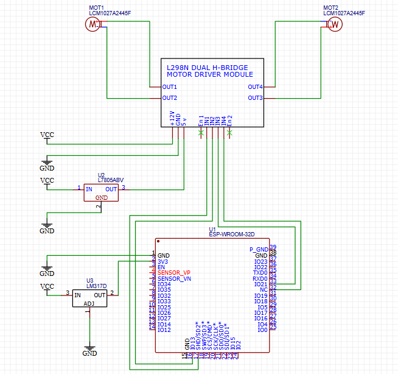

# Ponte H com motores DC

Este circuito é composto por diversos componentes que permitem o controle de dois motores DC usando uma ponte H L298N, juntamente com reguladores de tensão L7805 e LM317, e um microcontrolador ESP32 WROOM. A seguir, detalharemos a função e a ligação de cada componente:

## Componentes

1. **Ponte H L298N (Driver de Motor)**
   - A L298N é uma ponte H que permite controlar dois motores DC (DC Motor 1 e DC Motor 2).
   - Ela possui 4 entradas lógicas (IN1, IN2, IN3, IN4) que controlam o sentido de rotação dos motores e as saídas (OUT1, OUT2, OUT3, OUT4) conectadas aos motores.
   
2. **Motores DC**
   - São dois motores DC (Motores 1 e 2), controlados pela ponte H L298N.
   
3. **Controlador de Tensão L7805 (Regulador de 5V)**
   - O L7805 é um regulador de tensão linear que converte a tensão de entrada (VCC) para 5V, que é fornecida à L298N para alimentação de suas entradas lógicas.
   
4. **Controlador de Tensão LM317 (Regulador de 3.3V)**
   - O LM317 é um regulador de tensão ajustável, neste caso configurado para fornecer 3.3V, que é a alimentação da ESP32.
   
5. **Microcontrolador ESP32 WROOM**
   - O ESP32 é o cérebro do sistema, controlando a ponte H e os motores através das portas lógicas. Ele recebe alimentação de 3.3V via o LM317 e usa as portas digitais para controlar a direção dos motores.

## Esquemático de Conexões

``` 
                            +-------------------------+
                            |                         |
                          +-+---+       +---------+   |  
VCC --------------------| L298N |-----> | Motores  |   |
                          +-----+       +---------+   |
                               |                     |
       IN1 (GPIO 17) ----------+                     |
       IN2 (GPIO 16) ----------+                     |
       IN3 (GPIO 33) ----------+                     |
       IN4 (GPIO 32) ----------+                     |
                               |                     |
      5V -----------------> L7805 -----> 5V para IN1/2/3/4
      3.3V -----------------> LM317 -----> 3.3V para ESP32
      GND -------------------> GND de todos os dispositivos
````

## Funcionamento do Circuito

1. Controle dos Motores DC

O microcontrolador ESP32 controla os motores através da ponte H L298N. As portas digitais (GPIO 17 e 16 para os primeiros dois pinos IN) e (GPIO 33 e 32 para os dois últimos pinos IN) são usadas para determinar a direção dos motores conectados às saídas (OUT1, OUT2 para o motor 1 e OUT3, OUT4 para o motor 2).

2. Regulação de Tensão

O regulador de tensão L7805 converte a alimentação VCC do sistema para 5V, que é necessária para alimentar as entradas lógicas da ponte H L298N.

O regulador LM317 é configurado para fornecer uma tensão de 3.3V, que alimenta o ESP32, garantindo que ele opere na tensão correta.

3. Conexões de GND

Todos os dispositivos compartilham o mesmo GND, garantindo que o circuito tenha uma referência de aterramento comum, essencial para o correto funcionamento da lógica de controle.

## Diagrama Esquemático



Este diagrama do circuito mostra todas as conexões entre os componentes. Como descrito acima, as entradas da ponte H são controladas pelas portas lógicas do ESP32, enquanto os motores DC são alimentados e controlados por ela. O regulador de tensão L7805 garante que a Ponte H receba 5V para sua entrada lógica, e o regulador de tensão LM317 fornece os 3.3V necessários para o ESP32.

ass. @EricAraujoBsB
